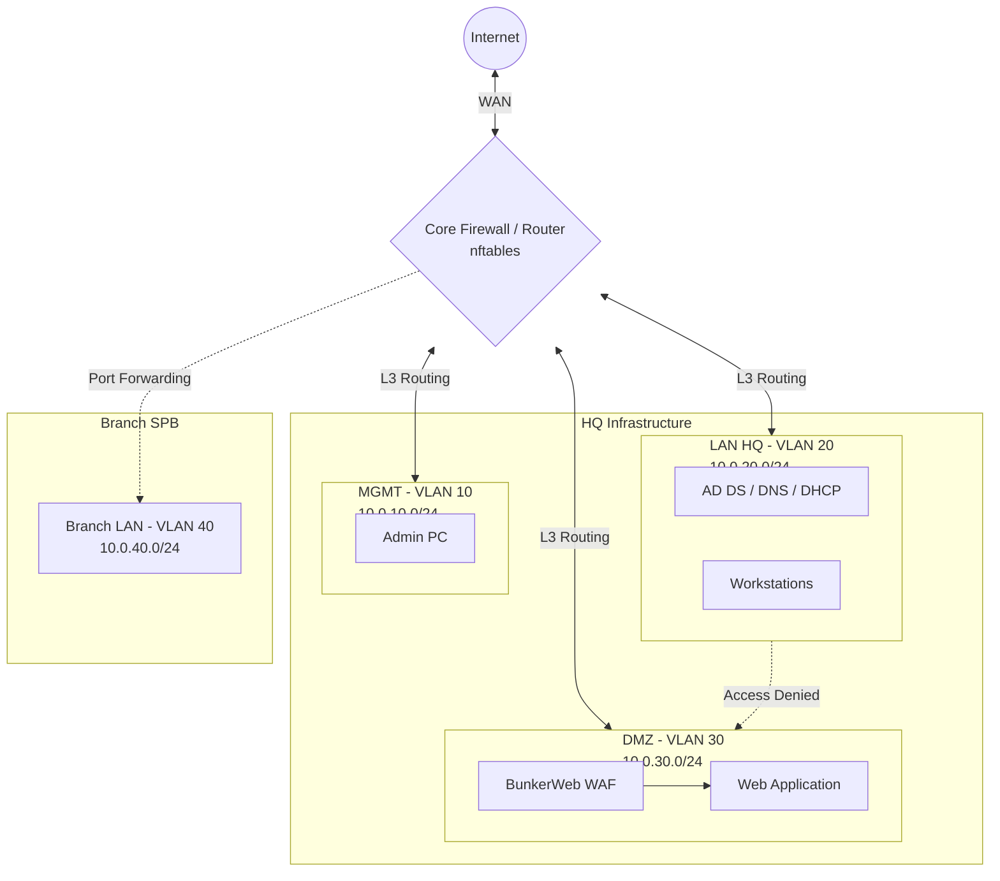

# Комплексный аудит и защита ИТ-инфраструктуры (SecOps Capstone)

## Описание проекта
Данный репозиторий содержит проектную документацию и конфигурационные файлы комплексной выпускной работы по направлению "Информационная безопасность" (SecOps). Проект описывает проектирование, развертывание и защиту распределенной ИТ-инфраструктуры, состоящей из центрального офиса (HQ) и филиала в Санкт-Петербурге (SPB). В рамках работы выполнена сетевая L2/L3 сегментация, настройка межсетевых экранов, развертывание антивирусной защиты и WAF.

## Стек технологий и инструментов
* **Сетевая безопасность:** nftables, BunkerWeb (WAF)
* **Антивирусная защита:** ClamAV
* **Инфраструктура и виртуализация:** Docker, Docker Compose, Linux (Debian/Ubuntu), Windows Server (AD DS, GPO)
* **Автоматизация:** Bash-скриптинг
* **Сетевые сервисы:** DNS, DHCP, NTP, FTP

## Архитектура и сегментация сети
Реализована строгая изоляция трафика между отделами и сервисами с использованием VLAN и правил маршрутизации. Базовая матрица сегментации:

* **MGMT (VLAN 10 | 10.0.10.0/24)**
  Управляющая сеть. Доступ разрешен исключительно для администраторов. Управление и настройка сетевого оборудования осуществляются преимущественно через CLI.
* **LAN HQ (VLAN 20 | 10.0.20.0/24)**
  Локальная сеть центрального офиса. Доступ в интернет через NAT. Доступ к DMZ строго регламентирован.
* **DMZ (VLAN 30 | 10.0.30.0/24)**
  Демилитаризованная зона. Размещены публичные веб-сервисы за WAF. Доступ из DMZ во внутренние сети (LAN) аппаратно и программно запрещен.
* **Branch SPB (VLAN 40 | 10.0.40.0/24)**
  Сеть филиала. Маршрутизация и фильтрация трафика настроены локально.

### Логическая топология сети

## Основные компоненты безопасности и конфигурации
Репозиторий содержит практические реализации следующих защитных механизмов:

### 1. Межсетевой экран (nftables)
Фильтрация трафика на уровне L3/L4 реализована с использованием nftables. Сконфигурированы правила stateful inspection (разрешение established/related, сброс invalid пакетов). Настроены правила маршрутизации и проброса портов (Port Forwarding) для филиала. Файл конфигурации: `nftables-spb-branch.conf`.

### 2. Защита веб-приложений (BunkerWeb)
В зоне DMZ развернут Web Application Firewall (BunkerWeb) в режиме обратного прокси-сервера (Reverse Proxy). WAF фильтрует L7-трафик до целевого веб-сервера, предотвращая эксплуатацию известных уязвимостей (SQLi, XSS, Path Traversal) и брутфорс-атаки.

### 3. Автоматизированная антивирусная защита (ClamAV)
Для обеспечения безопасности файловых систем настроена регулярная проверка на наличие вредоносного ПО. Сервис работает в изолированной контейнерной среде (`clamav.yml`). Написан исполняемый Bash-скрипт для автоматизации полного сканирования директорий. Файл скрипта: `clamav_full_scan.sh`.

### 4. Инфраструктура филиала (Infrastructure as Code)
Сервисы филиала развернуты с использованием подхода IaC через Docker Compose. Результаты тестирования политик безопасности и сетевой связности задокументированы. Файл развертывания: `docker-compose-branch.yml`. Логи верификации: `test_p_final.txt`.
